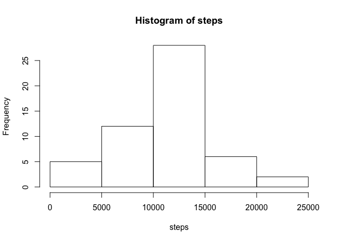
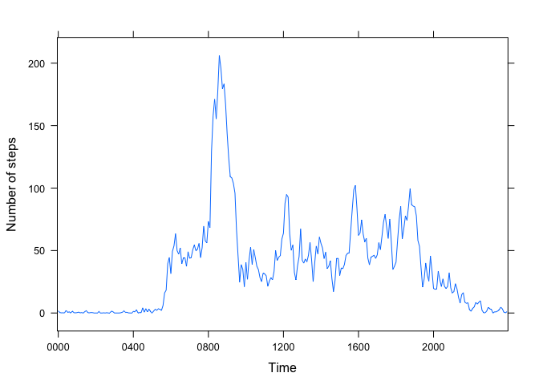

# Reproducible Research: Peer Assessment 1


## Loading and preprocessing the data

```r
filename <- "activity.csv"
if(!file.exists(filename)) {
        unzip("activity.zip")
        }
data <- read.csv(filename)

data$date <- as.Date(data$date)
data$hour <- data$interval %/% 100
data$minute <- data$interval %% 100
library(lubridate)
data$DateTime <- ymd_hm(paste0(data$date, " ", data$hour, ":", data$minute))
data$Time <- as.factor(format(data$DateTime, "%H%M"))
```

## What is mean total number of steps taken per day?

```r
steps <- xtabs(steps ~ date, data)

hist(steps)
```

 

```r
smean <- mean(steps)
smedian <- median(steps)
```
The mean and median of the total number of steps taken per day are 10766 and 10765, respectively.

## What is the average daily activity pattern?

```r
library(lattice)
mean_steps <- aggregate(steps ~ Time, data, mean)
End <- length(mean_steps$Time)
Xaxis <- seq(1, End, End/6)
Ylab <- "Number of steps"
xyplot(steps ~ Time, data = mean_steps, type = "l",
       scales = list(x = list(at = Xaxis)), ylab = Ylab)
```

 

```r
max_steps <- mean_steps[mean_steps$steps == max(mean_steps$steps), 1]
```
0835 contains the maximum number of steps on average across all the days in the dataset.

## Imputing missing values

```r
NAs <- sum(apply(data, 1, anyNA))
```
The total number of missing values in the dataset is 2304.

The mean for the respective 5-minute interval is used for filling in all of the missing values in the dataset.

```r
data_fill_na <- data
suppressWarnings(
        for (i in seq_along(data_fill_na$steps)) {
                if(is.na(data_fill_na$steps[i])) {
                        data_fill_na$steps[i] <- mean_steps[mean_steps$Time
                                                    == data_fill_na$Time, 2]
                }
        }
        )

steps_noNA <- xtabs(steps ~ date, data_fill_na)
hist(steps)
```

 

```r
smean_noNA <- mean(steps_noNA)
if (smean_noNA == smean) {
        mean_diff <- "the same as"
} else if (smean_noNA > smean) {
        mean_diff <- "larger than"
} else {
        mean_diff <- "smaller than"
}

smedian_noNA <- median(steps_noNA)
if (smedian_noNA == smedian) {
        median_diff <- "the same as"
} else if (smedian_noNA > smedian) {
        median_diff <- "larger than"
} else {
        median_diff <- "smaller than"
}

if(mean_diff == median_diff) {
        also <- "also "
} else {
        also <- ""
}
```
The mean total number of steps taken per day is 9419 that is smaller than the estimates from the first part of the assignment,
whereas the median total number of steps taken per day is 10395 that is also smaller than the estimates from the first part of the assignment.

## Are there differences in activity patterns between weekdays and weekends?

```r
data_fill_na$Day <- weekdays(data_fill_na$DateTime)
for (i in seq_along(data_fill_na$Day)) {
        if ((data_fill_na$Day[i] == "Saturday") |
                    (data_fill_na$Day[i] == "Sunday")) {
                data_fill_na$Day[i] <- "weekend"
        } else {
                data_fill_na$Day[i] <- "weekday"
        }
}

mean_steps_days <- aggregate(steps ~ Time + Day, data_fill_na, mean)

xyplot(steps ~ Time | Day, data = mean_steps_days, layout = c(1,2), type = "l",
       scales = list(x = list(at = Xaxis)), ylab = Ylab)
```

 
